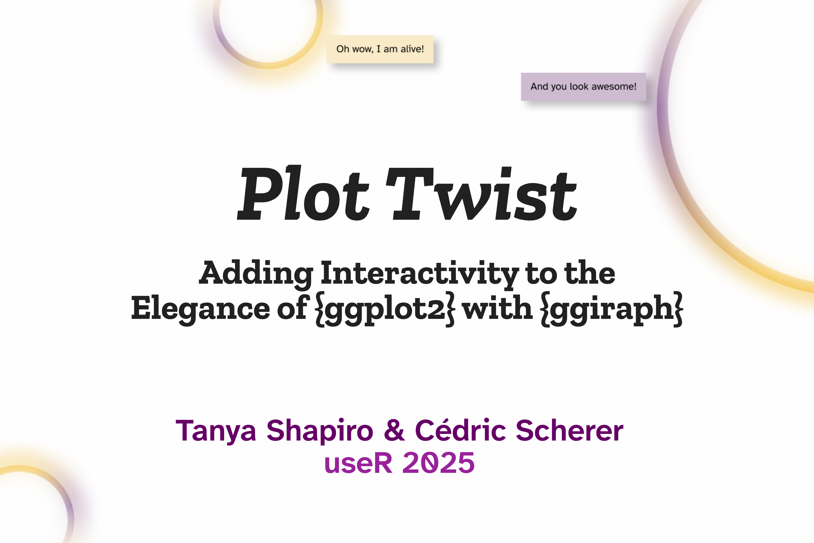

### "Plot Twist" — A Talk for [useR 2025](https://user2025.r-project.org/) by [Cédric Scherer](https://www.cedricscherer.com/) and [Tanya Shapiro](www.indievisual.tech)

One of the most common critiques of ggplot2 is its lack of built-in interactivity. While static plots are powerful for storytelling, interactive visualizations can enhance exploration, engagement, and accessibility. The ggiraph package finally provides a seamless way to add interactivity to ggplot2—enabling hover effects, tooltips, and clickable elements—while preserving the familiar layered approach and custom theming.

In this talk, Tanya Shapiro and Cédric Scherer will demonstrate why ggiraph stands out among other solutions, such as plotly, and how it integrates effortlessly with ggplot2 and its extension ecosystem. We’ll walk through real-world examples, explore its key functionalities, and share practical tips for creating engaging and well-designed interactive visualizations with ggiraph.

Whether you're looking to make your research more engaging, enhance dashboards, or create interactive reports, this talk will provide a solid foundation for elevating your data storytelling with interactive visualizations.

## Codes for Showcase Examples

* [Intro Showcase "TfL Bikes"](https://github.com/z3tt/ggiraph-user-2025/blob/main/plots/showcase.R)
* [Style Tooltips](https://github.com/z3tt/ggiraph-user-2025/blob/main/plots/example-css-styling.R)
* [Modify Hovering Effects](https://github.com/z3tt/ggiraph-user-2025/blob/main/plots/example-hover.R)
* [Link Data across Plots](https://github.com/z3tt/ggiraph-user-2025/blob/main/plots/example-combined-plots.R)

## Resources mentioned

* ggiraph Book by David Gohel 👉 [ardata.fr/ggiraph-book](https://www.ardata.fr/ggiraph-book/)
* ggplot2 Extension Gallery 👉 [exts.ggplot2.tidyverse.org/gallery](https://exts.ggplot2.tidyverse.org/gallery)
* Awesome ggplot2 Collection by Eric Gahner 👉 [github.com/erikgahner/awesome-ggplot2](https://github.com/erikgahner/awesome-ggplot2)
